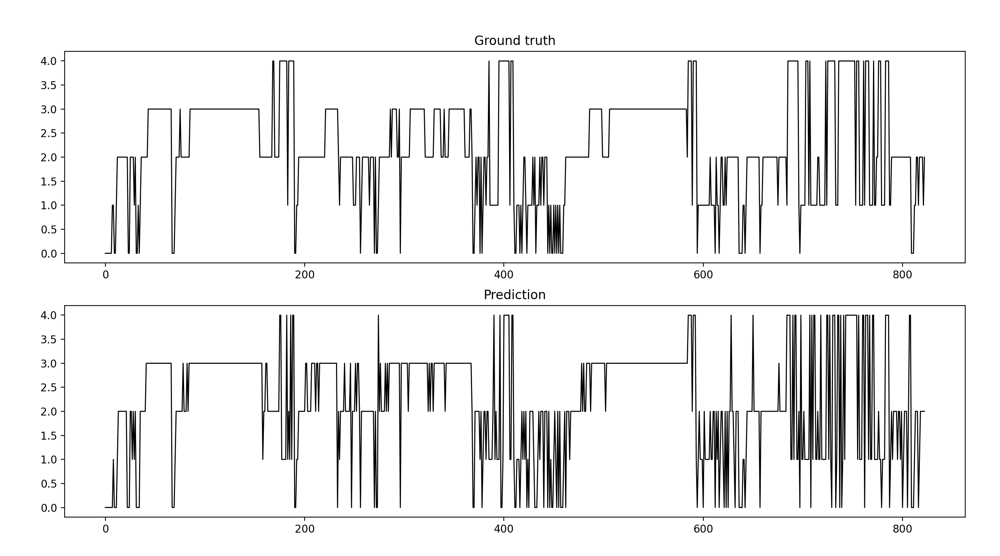

# DSN-repetition
This is an experimental implementation based on Deep Sleep Net

You can download the preprocessed ISRUC-s3 dataset in ``` .mat ``` form and put them in the following path:

``` 
./Data/data/subject1.mat
./Data/data/subject1.mat
...
./Data/data/subject10.mat

./Data/label/subject1.mat
./Data/label/subject2.mat
...
./Data/label/subject10.mat
```

To train the model, run the following command as an example:
```
python train2.py --channel 'F3_A2' --num_epochs 95 --lr 0.005 --batch_size 64 --window_size 20
```
The models will be saved to:
```
./Pretrain Model/DSN-1-F3_A2.pth
```
You can download the pretrained models and run the demonstration:
```
python demo.py --subject 9 --channel F3_A2 --model DSN-1-F3_A2.pth
```
Remember to move the pretrained models to the following path:
```
./Pretrain Model Save/DSN-1-F3_A2.pth
```
The demonstration output is like:
